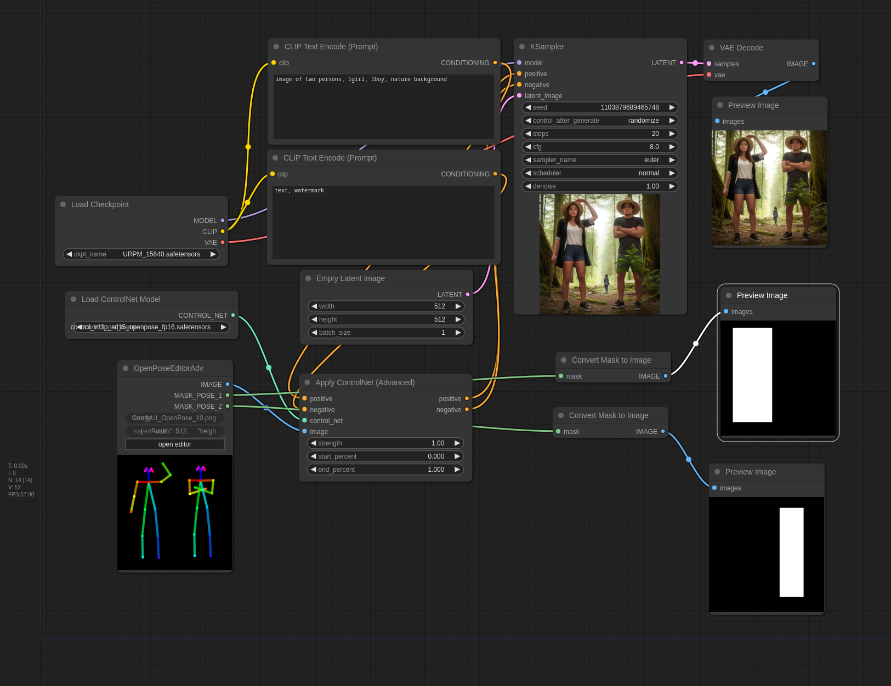

# 🖼️ ULTools for ComfyUI

Collection of tools supporting txt2img generation in [ComfyUI](https://github.com/comfyanonymous/ComfyUI) and other tasks.

## Nodes Included

SaveImgAdv

   

  *Forked from Kaharos94 / https://github.com/Kaharos94/ComfyUI-Saveaswebp and heavily adapted*

  Custom node to save a picture as webp or jpeg file in ComfyUI.

  Workflow saving and loading is supported by drag and drop or the standard load dialogue.

  Basic support of automatic1111 compatible prompt embedding and [CivitAI](https://civitai.com) model hashes.

  EXIF keywords can be stored in image meta data (goes nice with [WD14 tagger](https://github.com/pythongosssss/ComfyUI-WD14-Tagger)).

  **📔 Description**

  This adds a custom node to save a picture as png, webp or jpeg file and also adds a script to Comfy to drag and drop generated images into the UI to load the workflow.

  PNG images saved by default from the node shipped with ComfyUI are lossless, thus occupy more space compared to lossy formats.

  **⚙️ Options**
    - **Filename prefix**: just the same as in the original Save Image node of ComfyUI. **Supports creation of subfolders by adding slashes**
    - **Format**: png / webp / jpeg
    - **Compression**: used to set the quality for webp/jpeg, does nothing for png
    - **Lossy / lossless** (lossless supported for webp and jpeg formats only)
    - **Calc model hashes**: whether to calculate hashes of models used in the workflow and append the in CivitAI compatible format (AutoV2), so images are mapped to their resources automatically when uploaded
    - **Add automatic1111 meta**: whether to add a1111 compatible meta information to the image exif data, so that CivitAI may parse the prompt etc.
    - **Keywords**: can be used to store keywords in EXIF field ImageIFD/XPKeywords, e.g. when using [WD14 tagger](https://github.com/pythongosssss/ComfyUI-WD14-Tagger) (right click node, then click "convert keywords to input" to be able to plug them in)

  The compression slider is a bit misleading: In lossless mode, it only affects the "effort" taken to compress where 100 is the smallest possible size and 1 is the biggest possible size, it's a tradeoff for saving speed.

  In lossy mode, that's the other way around, where 100 is the biggest possible size with the least compression and 1 is the smallest possible size with maximum compression.

  On default it's set to lossy with a compression of 90.

  The workflow JSON is embedded in the EXIF metadata of the images, sections ImageIFD/Make for prompt and ImageIFD/ImageDescription for workflow meta. Automatic1111 prompt info is added at field ExifIFD/UserComment.

  **🚧 Known issues**

  Import of Webpfiles breaks if import a workflow that has }Prompt:{ in a Node that has dynamic wildcards disabled.

  Images posted on CivitAI created with this node will only use the automatic1111 compatibility metadata, not the workflow as with original ComfyUI PNG files.

  The filename index appending only works with an additional underscore being added.

  Prompt compatibility with automatic1111 is basic and hacky and will surely break for more advanced workflows. It works reasonably well for basic txt2img and tries doing its best to get a full positive and negative prompt by traversing through the node graph.

  CivitAI model hashes require the SHA256sum of the models used in the workflow which takes a while to calculate on the first execution. Hashes are cached in a simple JSON file.

  
CLIPTextEncodeWithStats

   

  Alternative for the regular CLIPTextEncode node which gathers statistics of the number of tokens and batches created from the input text.

  Due to limitations of the litegraph backend the node currently is not capable of a live calculation of the statistics. Instead, upon execution of the prompt, the node calculates the statistic and creates an image of the table which can be viewed in the PreviewImage node. It is an ugly solution but at least it works.

OpenPoseEditorAdv

   

  *Forked from space-nuko / https://github.com/space-nuko/ComfyUI-OpenPose-Editor with bugs fixed and heavily adapted*

  A port of the [openpose-editor](https://github.com/fkunn1326/openpose-editor) extension for stable-diffusion-webui

  The editor automatically generates a mask for each pose. Useful for specific conditioning per pose.

  **Usage**

  Import the `image > OpenPoseEditorAdv` node, add a new pose and use it like you would a `LoadImage` node. Each change you make to poses will be saved to the input folder of ComfyUI.

  **Example Workflow**

  

## 🖥️ Installation

In your terminal/console, navigate to your ComfyUI custom nodes directory and clone this repo:

  `git clone https://github.com/jkrauss82/ultools-comfyui.git`

Change into the directory:

  `cd ultools-comfyui`

Activate your python virtual environment and install the requirements (piexif, pandas, numpy):

  `pip install -r requirements.txt`

Restart ComfyUI.

## ⚠️ Warning

Hobby project, if you encounter bugs or problems feel free to create an issue, but not guarantee that it will be taken care of right away or ever.
